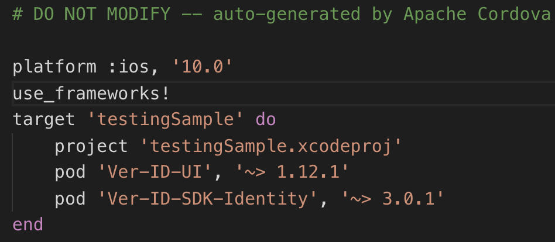

# Ver-ID Person Plugin for Cordova

## Introduction

The following instructions to run a sample will work for each of the
samples provided.

## Steps to run a cordova sample

1. [Request an API secret](https://dev.ver-id.com/admin/register) for the
   samples apps, you have to request the API secret for the
   **com.test.verid** bundle identifier. In case of using another one please
   request an API secret for the one you are using .
2. Clone the plugin Git repo into your file system:

    ~~~bash
    git clone --recurse-submodules https://github.com/AppliedRecognition/Ver-ID-Person-Cordova-Plugin.git
    ~~~
3. Navigate to the plugin directory and change to the samples branch:

	~~~bash
	git checkout samples
	~~~
4. Navigate to the sample project that you want to test:

	~~~bash
	Example: cd samples/cordova7.0.0_sample
	~~~
5. Now install the verid plugin and the cordova testing framework using the next command:

	~~~bash
	cordova plugin add  ../plugin cordova-plugin-test-framework
	~~~
6. Navigate to the plugins folder then go to **com-appliedrec-plugins-verid**
   directory and inside the tests directory open tests.js file and replace 
   **API KEY HERE** with the API secret that you got at first step:

7. From root sample directory, run the following command to add iOS and
   Android platforms:
    
    ~~~bash
	cordova platform add android@8.0.0 ios@5.0.0
	~~~
8. For iOS platform:
   - Navigate to **platforms/ios** and open the **Podfile** in a text editor.
     Add `use_frameworks!` after `platform :ios, '10.0'`. Close the file and run
     `pod install`
     to update the project.

     
    - Open Cordova app's iOS work space in Xcode.
    - Ensure the project's deployment target is iOS 10 or newer.
    - In your Xcode project's build settings ensure `SWIFT_VERSION` is set to **Swift 5**.
    - Open your app's **Info.plist** file and and ensure it contains an entry for `NSCameraUsageDescription`.
    - Select your app target and click on the **Build Settings** tab. Under
      **Build Options** ensure **Enable Bitcode** is set to **No**.

9. For Android platform:
   - Open **platforms/android** with Android Studio.
   - If an alert shows up requiring to sync gradle tap on the **Okay** button.

        
   - After that you may see the following error `ERROR: The minSdk version should not be declared in the android manifest file. You can move the version from the manifest to the defaultConfig in the build.gradle file.`,
   - **Solution:**	
		- **Step 1:** Remove `<uses-sdk android:minSdkVersion="21" />` in android's root directory->app->src->main->AndroidManifest.xml.		
		- **Step 2:** Remove `<uses-sdk android:minSdkVersion="19" />` in your android's root directory->CordovaLib->AndroidManifest.xml.

    - After removing those lines, go to the File menu of Android Studio and tap
      **Sync Project with Gradle Files**, once the process ends the app should
      be ready to run.
 
