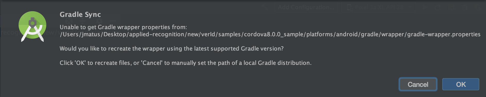

# Ver-ID Person Plugin for Cordova

## Introduction

The following instructions to run a sample will work for each of the
samples provided.

## Steps to run a Cordova sample

1. Clone the plugin Git repo into your file system:

    ```
    git clone https://github.com/AppliedRecognition/Ver-ID-Person-Cordova-Plugin.git
    ```
1. Check the Cordova version you are performing development with on your system:

	```
	cordova --version
	```
1. Navigate to the sample project that you want to test within the recently cloned repository, based off of the installed major version of Cordova you have installed.  These are located in the samples/cordova[VERSION]_sample directory (there are samples for major versions 7, 8 and 9).  For example:

	```
	cd samples/cordova7.0.0_sample
	```

1. From the selected sample project directory, run the following command to add iOS and Android platforms (these platform versions are the ones tested and supported in the current repository.  The supported Cordova and Cordova platform combinations can be found [here](README.md) under the Compatibility section:
    
    ```
    cordova platform add android@8.0.0 ios@5.0.0
	  ```

1. From the selected sample project directory, install the Ver-ID plugin using the following command (note: the certificate is inside samples/assets directory):

	```
	cordova plugin add  ../../ --password=41475bf3-ca73-4579-b909-07228ed85b17 --certificate="../assets/Ver-ID identity.p12"
	```

1. Install Cordova testing framework using the next command:

    ```
	  cordova plugin add  cordova-plugin-test-framework
	  ```

1. For iOS platform:
   - Navigate to **platforms/ios** and open the **Podfile** in a text editor.
     Add `use_frameworks!` after `platform :ios, '10.3'`. Close the file and run
     `pod install`
     to update the project.

    - Open Cordova app's iOS work space in Xcode.
    - Ensure the project's deployment target is iOS 10 or newer.
    - In your Xcode project's build settings ensure `SWIFT_VERSION` is set to **Swift 5**.
    - Open your app's **Info.plist** file and and ensure it contains an entry for `NSCameraUsageDescription`.
  

1. For Android platform:
   - Open **platforms/android** with Android Studio.
   - If an alert shows up requiring to sync gradle tap on the **Okay** button.

        
   - After that you may see the following error `ERROR: The minSdk version should not be declared in the android manifest file. You can move the version from the manifest to the defaultConfig in the build.gradle file.`,
   - **Solution:**	
		- **Step 1:** Remove `<uses-sdk android:minSdkVersion="21" />` in android's root directory->app->src->main->AndroidManifest.xml.		
		- **Step 2:** Remove `<uses-sdk android:minSdkVersion="19" />` in your android's root directory->CordovaLib->AndroidManifest.xml.

    - After removing those lines, go to the File menu of Android Studio and tap
      **Sync Project with Gradle Files**, once the process ends the app should
      be ready to run.
 
